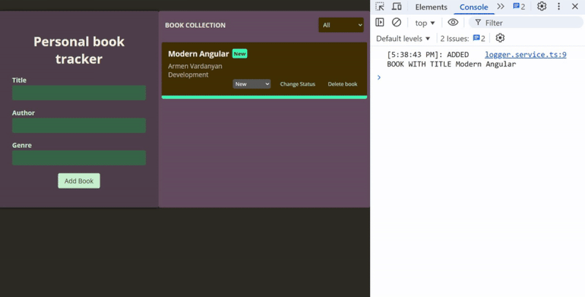

# Services & dependency injection practical task

A repository for a personal book management application is provided, which allows you to add new books, change their status, and delete them from the library. It is necessary to implement services for library management. Services are injected into the corresponding components. User interaction with components calling corresponding service methods.
Your app should work as shown below:

## Services

**BooksService** 
• Contains methods for adding a new book, changing the status of an existing book, and deleting a book from the library
• Uses an in-memory array to store books (in a real app, this would connect to a backend)
• Uses LoggerService to accompany the actions of adding a new book, changing the status, and deleting a book with corresponding messages to the console indicating the time and description of the action

**LoggerService** 
• Provides the ability to accompany actions on books in the application with corresponding messages to the console indicating the time of the operation
• Contains a method that outputs the time and description of the action performed on the book to the console.
• Injected into the BooksService service

## Dependency Injection 

• Both services are provided at the root level

## Main components

**BookItemComponent** 
• The component implements the book entity in the project, contains the logic and user interface for changing the status and deleting the book
• The component accepts an entity of type Book as input
• Displays a description of its status in the component template next to the book name. For the 'NEW' status, the description 'New' is displayed, for the 'IN_PROGRESS' status, the description 'Currently reading' is displayed, for the 'FINISHED' status, the description 'Finished' is displayed
• Changes the display style of the component depending on the status of the book
• Contains a method for changing the current status of the book
• Contains a method for deleting the current book from the library
• Uses a service to change the status and delete the book

**BooksListComponent** 
• The component displays a collection of books available in the personal library
• Contains the logic for generating a list of books based on the current value of the selected filter
• Uses a service to generate a list of books
• Allows you to filter books by the following statuses: "All", "New", "In-progress", "Finished"
• All books are displayed by default

**AddBookComponent** 
• The component contains the functionality of adding a new book to the library
• Contains a method for adding a new book to the collection
• Uses a service to add a new book to the collection
• By default, a newly created book has the status “New”

## Model

• Contains the Book interface with the corresponding fields
• Contains the BookStatus type with the book statuses

## Video

• The final result of the task should be a short video that you record and upload for verification, demonstrating the correct operation of the application
• The video should show the implementation of the functionality of adding, changing the status, deleting and filtering books and the corresponding notifications in the console
